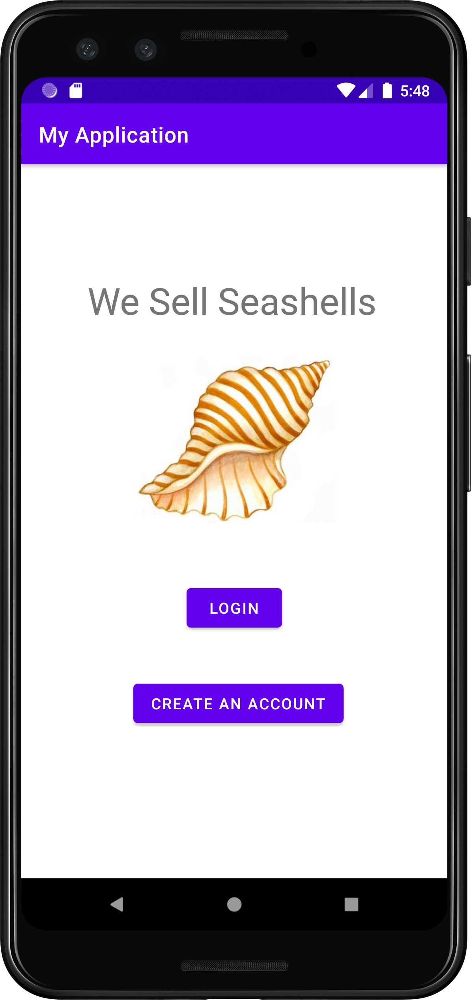

# Software Design Class Final Project

##Android App 

For the Final Project of CST 338 - Software Design at CSUMB, I designed and built an E-Commerce Android App. 

The App was built in Android Studio with Java for handling all application logic and user interaction and Android Room for database management.

Steps I took in this process:
-Designed User Interface
-Wrote Java code for navigation between pages
-Designed and built Database using Draw.io and MySQL
-Implemetemented Android Room for interactions between App and Database
-Wrote user Acceptance Tests for possible interactions and desired behaviors
-Performed Testing
-Delivered Final Project and Report on Test Cases.

[Use Case Performance Report](https://youtu.be/nYhJ4JHM77w)

